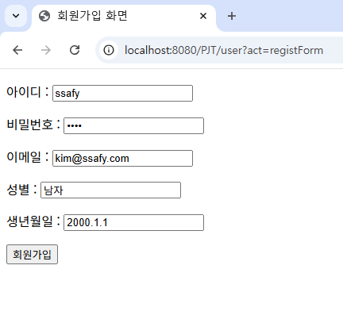
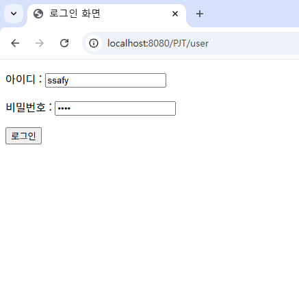
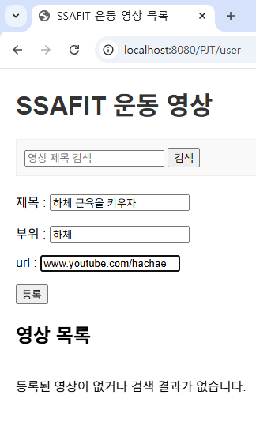
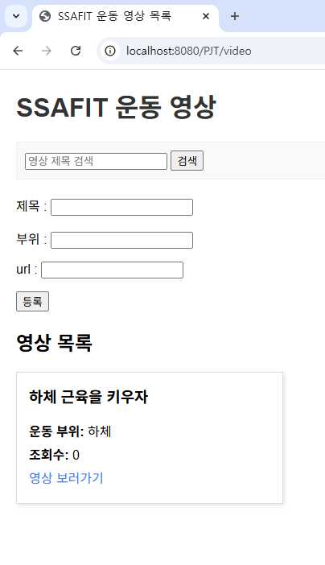
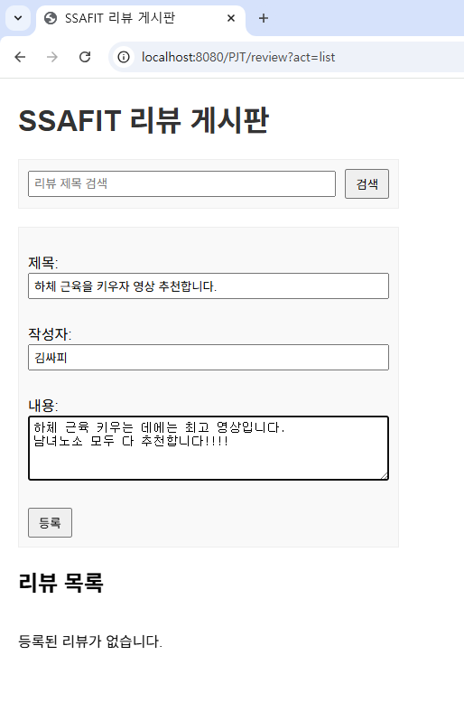
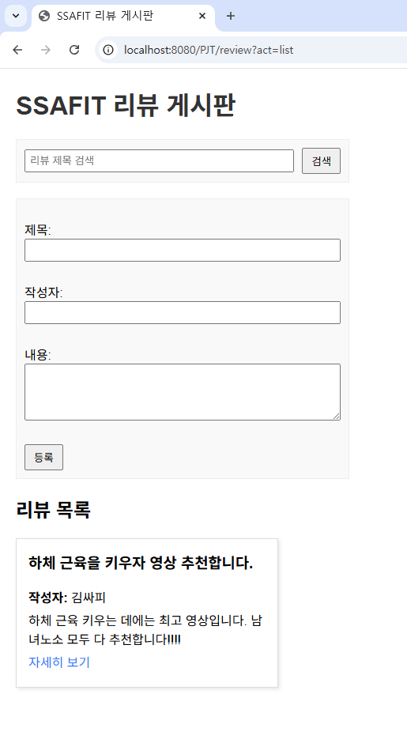

# PJT4-SSAFIT-F
- 팀장: 규봉
- 팀원: 소연, 정현

# SSAFIT

# 0. 프로젝트 개요
- SSAFIT은 운동 영상 정보를 활용한 운동 추천 및 리뷰 서비스로, 운동 영상 정보를 관리하고 영상 검색 기능, 운동 부위별 영상 추천 기능, 영상에 대한 리뷰및 커뮤니티 기능, 운동계획 관리 기능 등을 제공하는 서비스입니다.
- 각 영상 상세 페이지에서는 영상 시청과 리뷰 작성, 타 사용자의 리뷰를 확인할 수도 있습니다.
- 본 프로젝트는 Servlet, JSP를 이해하고, Tomcat 환경에서 요청/응답 흐름을 제어하는 웹 서버를 구축 및 MVC 아키텍처를 이해하고 활용하고자 진행하였습니다.

<br>

# 1. 준비 사항
### 1. 사용 데이터
- Youtube 영상 데이터 사용

### 2. 개발언어 및 툴
- Java, STS, HTML, CSS, JavaScript, VScode, Tomcat

### 3. 필수 라이브러리 / 오픈소스
- BootStrap Framework

<br>

# 2. 작업 순서
### 1. 역할 분배
- 기본 템플릿 제작
- User, Video, Review로 나눠 진행

### 2. MVC 계층을 배치한 아키텍처, 클래스 다이어그램 초안 작성

### 3. 생성형 AI를 활용한 다이어그램의 개선 포인트를 작성

### 4. 설계한 프로젝트를 구현 및 개발

<br>

# 3. 기능
### 1. 필수 기능
- 회원 정보 관리 (로그인 / 로그아웃 / 작성 / 조회 / 수정 / 삭제)
- 영상 정보 관리 (영상 정보 / 부위 별 등 검색 기능 / 영상에 대한 리뷰)

### 2. 추가 기능
- 영상 정보 관리 (찜 영상 목록)
- 커뮤니티 관리 (자유 게시판, 회원 팔로우 기능)
- 운동계획 관리 (운동 계획, 시각적인 기능 등)

<br>

# 4. 프로젝트 구조
```
ssafit/
├── src/
│   ├── main/
│   │   ├── java/
│   │   │   └── com/pjt4/ssafit/
│   │   │       ├── controller/
│   │   │       │   ├── ReviewController.java
│   │   │       │   ├── UserController.java
│   │   │       │   └── VideoController.java
│   │   │       ├── dto/
│   │   │       │   ├── Review.java
│   │   │       │   ├── User.java
│   │   │       │   └── Video.java
│   │   │       ├── repository/
│   │   │       │   ├── ReviewRepository.java
│   │   │       │   ├── ReviewRepositoryImpl.java
│   │   │       │   ├── UserRepository.java
│   │   │       │   ├── VideoRepository.java
│   │   │       │   └── VideoRepositoryImpl.java
│   │   │       └── service/
│   │   │           ├── ReviewService.java
│   │   │           ├── ReviewServiceImpl.java
│   │   │           ├── UserService.java
│   │   │           ├── UserServiceImpl.java
│   │   │           ├── VideoService.java
│   │   │           └── VideoServiceImpl.java
│   └── webapp/
│       ├── WEB-INF/
│       │   ├── review/
│       │   │   ├── detail.jsp
│       │   │   ├── list.jsp
│       │   │   ├── view.jsp
│       │   │   └── writeform.jsp
│       │   ├── user/
│       │   │   ├── login.jsp
│       │   │   ├── regist.jsp
│       │   │   └── view.jsp
│       │   └── video/
│       │       ├── detail.jsp
│       │       └── view.jsp
│       └── index.jsp
└── README.md

```
<br>

# 5. 구현 화면 예시

### 1. 회원가입 화면


### 2. 로그인 화면


### 3. 영상 등록 화면


### 4. 영상 목록 조회 화면


### 5. 리뷰 게시판 화면


### 6. 리뷰 목록 조회 화면



# 6. 소감
이번 프로젝트를 통해 MVC 패턴을 직접 익히고, 웹 애플리케이션의 기본 구조를 이해할 수 있었습니다. 아직 부족한 점도 있지만, 직접 설계하고 구현하면서 전체적인 흐름을 감 잡을 수 있었습니다.

또한, Git 협업 경험도 많이 쌓을 수 있었습니다. cherry-pick으로 커밋을 선택해보고, git restore를 사용하며 변경 사항을 되돌려보는 경험, 그리고 충돌 발생 시 직접 해결해보면서 앞으로 팀 프로젝트에서 Git을 활용한 협업 능력이 훨씬 향상될 것 같습니다.

이번 프로젝트를 통해 얻은 경험과 배움을 바탕으로, 다음 프로젝트에서는 백엔드와 프론트엔드를 균형 있게 개발하고, 효율적인 협업까지 더 발전시킬 수 있을 것 같다는 자신감을 얻었습니다.
